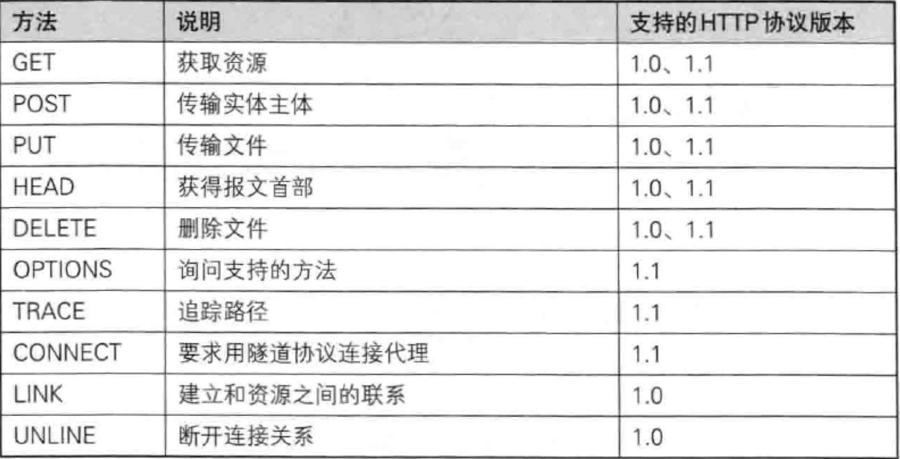
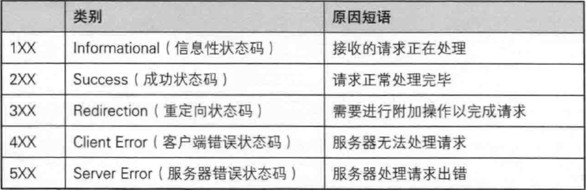

# 一、http基础知识
### 1、http1.0和http1.1支持的方法

### 2、持久连接：只要任何一方没有明确提出断开连接，则保持tcp连接状态。
**http1.1中所有连接默认持久连接**
### 3、Cookie
http本是无状态协议，但服务端写入cookie并且由客户端保存cookie，下次请求会将cookie发送到服务端，服务端判断是从哪儿来的或一些身份信息等，以此来记录状态。
### 4、内容编码
在实体内容上进行的编码格式，保持信息原样压缩。  
gzip、compress、deflate、identity  
### 5、多部分对象集合(Multipart)
multipart/form-data  
multipart/byteranges  
### 6、获取部分内容的范围请求（range request）
Range: byte=1000~2000
### 7、状态码
#### 1）、状态码的类别

#### 2)、常用的状态码
2XX:200 OK, 204 No Content, 206 Patitial Content  
3XX:301 Moved Permanently, 302 Found, 303 See Other, 304 Not Modified, 307 Temporary Redirect  
4XX:400 Bad Request, 401 Unauthoried, 403 Forbidden, 404 Not Found  
5XX:500 Internal Server Error, 503 Service Unavaliable  

